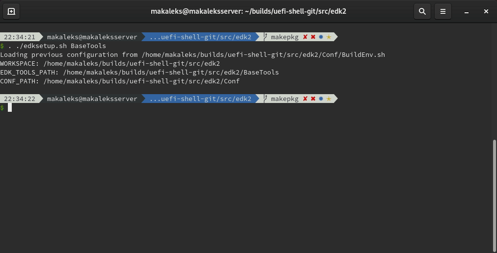

# EDK2 Compilation Database patch

This tweak is aimed at providing completion experience in edk2-based projects
(UEFI-level development) by providing an ability to generate
[compile_commands.json](https://clang.llvm.org/docs/JSONCompilationDatabase.html) 
files - this file can be used by competion engines. I managed to make it working
on [neovim](https://neovim.io/) with 
[coc.vim](https://github.com/neoclide/coc.nvim) plugin, connected to
[ccls](https://github.com/MaskRay/ccls) language server:



## Installation

This patch requires a single function call, that doesn't change the context.
This function requires some data about the file build options.

Feel free to explore `edk2_compile_commands.py` script. The least procedure does
the main logic: creates compilation-database file and edits it. Other procedure
is a compatibility adapter, that will extract the required data from edk2 build
process. If happens that compatibility is broken (tested on spring 2018
version), you are free to add or edit your own adapter - the completion
ability worth it.

The following shows an example of how to enable generation of your compilation 
flags:
1. Clone the repo and go to the patch directory.
   ```bash
   git clone https://github.com/makaleks/edk2-tools
   cd compilation_database_patch
   ```
2. If supported, create a hard link to the edk2-build-system scripts. If not
   supported, just copy the patch file. Hard link creation example:
   ```bash
   ln edk2_compile_commands.py $(EDK2_ROOT)/BaseTools/Source/Python/edk2_compile_commands.py
   ```
3. Insert the generation adapter function into build-rules-generation file
   `BaseTools/Source/Python/AutoGen/GenMake.py`:
   ```python
   # import the compatibility function somewhere
   from edk2_compile_commands import update_compile_commands_file
   # ... Find the following (for me, it is line 971):
   TargetDict = {
       "target" : <whatever>,
       "cmd"    : <whatever>,
       "deps"   : <whatever>
   }
   # Insert the function
   update_compile_commands_file(TargetDict, self._AutoGenObject, self.Macros)
   # Keep the least as-is
   self.BuildTargetList...
   ```
4. Fully rebuild the project, including regeneration of build rules. This is not
   required for projects, that have never been built.
   ```bash
   rm -r Build/AppPkg/DEBUG_GCC5/X64/AppPkg/Applications
   build -p AppPkg/AppPkg.dsc
   ```
5. Since now, your compilation flags are generated. If you add new files to your
   project, edk2 will generate additional build rules and the patch will update
   compilation flags:
   ```bash
   build -p AppPkg/AppPkg.dsc
   ```

Enjoy!

