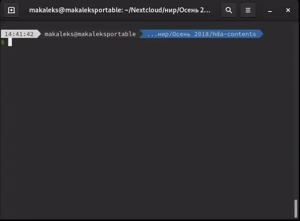

# QEMU & GDB

The provided script is aimed at saving the developer's time while following edk2
official
[guide about debugging UEFI apps with GDB](https://github.com/tianocore/tianocore.github.io/wiki/How-to-debug-OVMF-with-QEMU-using-GDB).
Manual search and string manipulations from that guide takes many steps before
getting any significant result, which makes it an evident field for improvement.



## Environment (pre-installation)

This chapter covers how to build OVMF and prepare the QEMU environment. If you
have already run your UEFI images, you can skip this chapter. The following
structure will be created:
``` bash
tree uefi-env
# uefi-env
# ├── hda-contents
# │   ├── Shell.debug
# │   └── Shell.efi
# ├── OVMF.fd
# └── run-qemu.sh
```

In theory, the provided script can help with any `.efi`-image for any
QEMU-compatible implementation of UEFI. These guide will cover the typical UEFI
development environment for Linux, with `QEMU` (emulator), `GNU GDB` (debugger),
`edk2` (UEFI development framework) and, of course, `GNU Coreutils` installed
(tools, preinstalled nearly on all Linux systems).

0. First, go to your edk2 workspace and get ready to build [OVMF]:
   ```bash
   cd your_edk2_workspace/
   ```
   ```bash
   . ./edksetup.sh BaseTools
   ```
1. Choose any directory on your filesystem to be a runtime environment to run
   QEMU. Inside, create a directory for UEFI images (here, named
   'hda-contents'):
   ```bash
   mkdir -p uefi-env/hda-contents
   ```
2. Then, get [OVMF]. You may find it in your distributive repositories (known
   as, for example, `uefi-shell-git` in Arch user repository and `ovmf` in
   Debian non-free repository) or build it yourself (OVMF sources are part of
   edk2). This step will cover building OVMF from source and assume, that our
   UEFI images will be created using edk2 in further steps.
   1. If haven't done yet, [setup edk2].
   2. Then, load the edk2 environment, build OVMF (X64 in this example) and
        copy (or, as in example, make a hard link) it to uefi-env/ from the 
        first step.
        ```bash
        . ./edksetup.sh BaseTools
        build -p OvmfPkg/OvmfPkgX64.dsc
        ln Build/OvmfX64/DEBUG_GCC5/FV/OVMF.fd ~/.../uefi-env/OVMF.fd
        ```
3. Prepare your UEFI image. As an example, UEFI Shell will be shown here.
   1. First, make sure that your build target is DEBUG or NOOPT (NOOPT is
        better). This is required to generate debug symbols and enable
        source-level (when you see your code) debug. If your TARGET is not
        either DEBUG or NOOPT, set it to NOOPT:
        ```bash
        grep -n '^TARGET ' Conf/target.txt
        ```
   2. Then, build your package (UEFI Shell in this example), copy (in example 
        - make hard link)_ `.efi` and its symbol file to
        uefi-env/hda-contents from the first step.
        ```bash
        build -p ShellPkg/ShellPkg.dsc
        ln Build/Shell/NOOPT_GCC5/X64/Shell.{efi,debug} ~/.../uefi-env/hda-contents/
        ```
   3. It is convenient to prepare script for running QEMU, this step is
        optional, but will be used further:
        ```bash
        echo qemu-system-x86_64 -bios OVMF.fd -s -debugcon file:debug.log -global isa-debugcon.iobase=0x402 -drive file=fat:rw:hda-contents,format=raw -m 1G -enable-kvm -cpu host -serial stdio > run-qemu.sh
        chmod +x run-qemu.sh
        ```

## Installation

Assuming your OVMF environment is similar to the described in the previous
chapter, prepare the script:

```bash
git clone https://github.com/makaleks/edk2-tools
ln uefi_and_gdb/gdb_add_symbol.sh ~/.../uefi-env/hda-contents/gdb_add_symbol.sh
```

## Usage

Script usage is similar to the official [guide about debugging with GDB], but
makes the process shorter. Requires 2 terminal windows opened to run qemu and
gdb simultaneously.

```bash
# QEMU terminal
cd ~/.../uefi-env/
```

```bash
# GDB terminal
cd ~/.../uefi-env/hda-contents/
```

1. Before the first usage, run QEMU and load your `.efi` (Shell.efi in the
   example) file in the EFI Internal Shell. Be ready to press Escape key, when
   the Tianocore logo appears:
   ```bash
   # QEMU terminal
   ./run-qemu.sh
   ```
   If you run OVMF for the first time, you may wish to change the boot order to
   launch UEFI Shell first. To do that, when the Tianocore logo appears (right
   after QEMU was launched), press Escape to enter UEFI menu, go to `Boot
   Maintance Manager`>`Boot Options` > `Change Boot Order`. When the boot order
   is changed, save it (F10 for me), return to the main menu, press Continue.  
   **Load the image for the first time** - this is required to get the address,
   where our destination `.efi`-image will be loaded next time.
   ```bash
   # QEMU terminal, with EFI Internal Shell launched
   fs0:
   Shell.efi
   ```
   Then quit QEMU virtual machine.
2. Run `gdb_add_symbol.sh` to generate GDB `add-symbol-file` command with all
   addresses computed. Note that we need the second entry of Shell.efi, because
   the first time Shell.efi is loaded when we load EFI Internal Shell. The
   result should be copied to the clipboard, for X11 done simplier via xclip:
   ```bash
   # GDB terminal
   ./gdb_add_symbol.sh Shell.efi 2 | xclip -sel clip
   ```
   Run GDB and paste the clipboard content using mouse or Ctrl+Shift+V. The
   following is similar to the official guide (except the fact that nothing
   works on my machine if I don't set architecture explicitly):
   ```bash
   # GDB terminal
   gdb --tui
   # Now GDB started, GDB commands:
   add-symbol-file Shell.debug 0x3e4f4240 -s .data 0x3e5b4980
   set architecture i386:x86-64
   target remote localhost:1234
   ```
3. Now, launch QEMU. It must freeze immediately (because GDB has found and
   stopped it), so GDB must set a breakpoint. Here, the first breakpoint will be
   set for UefiMain, defined at
   `<edk2-environment>/ShellPkg/Application/Shell/Shell.inf:ENTRY_POINT`. On my
   machine, nothing works if the first breakpoint is not 'hardware' (`hbreak` or
   `hb` command):
   ```bash
   # GDB terminal
   hb UefiMain
   c
   ```
   ```bash
   # QEMU terminal
   ./run-qemu.sh
   # Now started QEMU>OVMF>EFI Internal Shell, Shell commands:
   fs0:
   Shell.efi
   ```
   Now, GDB must show the source code around the breakpoint. If this did not
   happen, see Troubleshooting below ('GDB: no debugging symbols found').
4. Now, all works, and we can debug as we used in Linux. For example, let's
   break the 'drivers' command:
   ```bash
   # GDB terminal
   b ShellCommandRunDrivers
   c
   ```
   ```bash
   # QEMU terminal, Shell.efi launched
   drivers
   ```

Enjoy!

## Troubleshooting

### GDB: no debugging symbols found
GDB says something like `Shell.debug has a corrupt section with a size 
(58a00000001) larger than the file size` or `no symbols found`. This is because
symbols were not included. This happens with some EDK2 distributions. Go to your
edk2 environment, and get your target compiler:
```bash
grep -n 'TOOL_CHAIN_TAG' Conf/target.txt
# TOOL_CHAIN_TAG        = GCC5
```
Next, find this toolchain and add `-g` flag to it in `Conf/tools_def.txt`, or 
even to all toolchains by patching the line like `DEFINE GCC44_ALL_CC_FLAGS`.

### GDB: file format not recognized, no break at breakpoint
That can be caused by QEMU, that corrupts files in directories (you can even
find unexpectable message from your text editor that `gdb_add_symbol.sh` was
changed). Requires to recreate hda-contents everytime, or put it into QEMU image
file. For me, it also worked to pass QEMU image as the first drive, while still
using hda-contents for `.efi` loading (in this case it becomes `fs1:` in the
Shell), although sometimes other files in this directory got corrupted.

[guide about debugging with GDB]: https://github.com/tianocore/tianocore.github.io/wiki/How-to-debug-OVMF-with-QEMU-using-GDB
[OVMF]: https://github.com/tianocore/tianocore.github.io/wiki/OVMF-FAQ#what-is-open-virtual-machine-firmware-ovmf
[setup edk2]: https://github.com/tianocore/tianocore.github.io/wiki/Common-instructions-for-Unix

